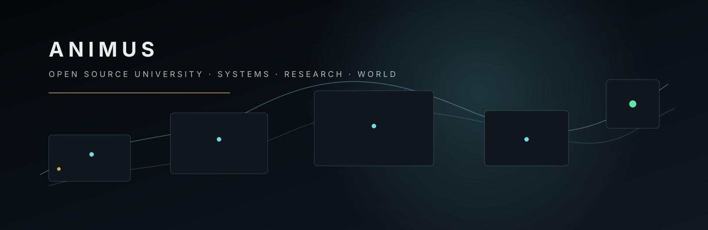

<p align="center">
  
</p>

# Animus Open Source University

**Animus is an international open-source university and engineering laboratory building human-controlled computing systems, reproducible research infrastructure, secure connectivity, and browser-native learning worlds.**

We treat software, research, media and interactive worlds as parts of one evidence-driven system: ideas should be inspectable, computation should be reproducible, authority should remain explicit, and users should retain control over their data and devices.

[**kapakka.org**](https://kapakka.org) · [**Research**](https://kapakka.org/research/) · [**Link**](https://kapakka.org/link/) · [**Systems**](https://kapakka.org/systems/) · [**Public DataLab SDK**](https://github.com/Animus-OSC/animus-datalab-sdk)

## Programs

### AOS / Personal Cell

A user-owned, local-first personal computing direction in which models, devices and external services are replaceable capabilities beneath a persistent personal layer. The public research direction emphasizes encrypted user-controlled continuity, minimum-sufficient disclosure and useful offline operation. Target architecture is labeled as target architecture rather than presented as universally deployed product behavior.

### Animus Link

Secure connectivity research and production engineering around cryptographic identity, encrypted sessions, private discovery, relay-assisted transport and explicit authority boundaries. Public product/research context lives at **[kapakka.org/link](https://kapakka.org/link/)**; repository visibility follows the project's graduation/security policy rather than the needs of this profile page.

### Animus DataLab

Governed ML/research infrastructure built around Control Plane / Data Plane separation, reproducible execution, lineage, audit and bounded artifact handling. The currently public code surface is the typed, zero-runtime-dependency **[Animus DataLab Python SDK](https://github.com/Animus-OSC/animus-datalab-sdk)**.

### Animus University & Adventure

The University is not an LMS. It is a learning system spanning research, primary sources, lectures, evidence, notebooks, simulations, engineering and immersive Adventure. The learning loop is:

```text
curiosity → evidence → explanation → experiment / simulation
          → creation → world / action → new evidence
```

Adventure is one spatial/game-engine representation inside the University; it does not imply that every Animus system surface is gamified.

### Engineering systems

Animus also develops evidence-driven tooling for bounded autonomous software engineering, document-governed delivery, reproducible media production and capability-scoped computation. Internal/private repositories remain private until their publication boundary is intentionally graduated.

## Operating principles

**User authority over model authority.** AI output can propose, explain and create; it does not become identity, policy or permission by itself.

**Local-first where it matters.** Personal continuity and sensitive user state are designed around user-controlled storage and devices. Network and cloud systems expand capability; they should not become the definition of the person.

**Evidence before claims.** We distinguish implemented behavior, release candidates, research hypotheses and target architecture. Exact-SHA tests, receipts and reproducible artifacts matter more than narrative confidence.

**Open by graduation, not by optics.** Public work should be understandable, safe to publish and useful to others. Private R&D is not exposed merely to make an organization page look fuller.

**The University is a system, not a content catalog.** The same knowledge can appear as story, lecture, visual explanation, evidence, primary sources, notebook, simulation, engineering task or Adventure — without changing the underlying truth/evidence contract.

## Visual language

Animus uses a restrained systems aesthetic: graphite and mineral surfaces, cold cyan/teal information paths, emerald for verified state, and rare warm amber for human presence. The intent is **systemic heroism / quiet infrastructure / human signal** — grounded engineering rather than generic cyberpunk.

Repository README art is stored with the source that uses it. Production documentation should not depend on temporary generation URLs or third-party image CDNs.

## Public entry points

- **[kapakka.org](https://kapakka.org)** — public Animus browser/research/University entry point.
- **[Research](https://kapakka.org/research/)** — published research and knowledge surfaces.
- **[Link](https://kapakka.org/link/)** — public Link context.
- **[Systems](https://kapakka.org/systems/)** — public engineering systems context.
- **[Animus DataLab Python SDK](https://github.com/Animus-OSC/animus-datalab-sdk)** — currently public GitHub code surface.

## Contributing

Public repositories carry their own architecture, security model, test commands and contribution rules. Read repository-local `README`, `CONTRIBUTING`, security documentation and specifications before making changes. A green result in one project is not authority to widen another project's scope.

---

<sub>ANIMUS · International · open source where safely graduated · human-controlled systems · reproducible evidence</sub>
